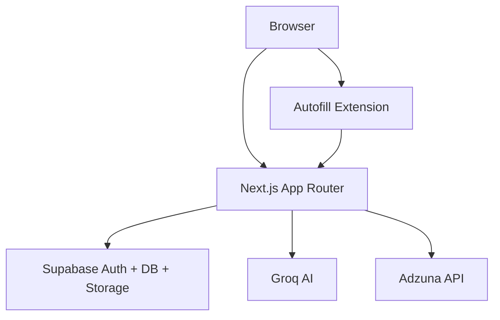

# Nextzen Orbit - App Overview

Last updated: 2026-05-23

## Purpose

Nextzen Orbit is an AI-assisted job search workspace for the Indian job market. It helps users build strong resumes, generate tailored content, track applications, and accelerate the job search process with assisted autofill (no auto-submit).

## What the product does

- Google OAuth sign-in and account setup
- Profile and job preference management
- Resume creation, upload, editing, and export
- AI analysis, improvement, and tailoring of resumes
- Cover letter generation and export
- Application tracking (kanban and table)
- Job search via external APIs
- Assisted autofill Chrome extension (user-controlled)
- Subscription tiers and payment groundwork

## Primary user journeys

1. Sign in with Google and create a profile.
2. Create or upload a resume, then edit and export it.
3. Analyze a resume against a job description and apply AI suggestions.
4. Generate a cover letter for a specific role.
5. Track applications in kanban or table view.
6. Search jobs, open listings, and use the extension to autofill forms before submitting manually.

## System architecture (high level)

- Next.js App Router provides all pages and API routes.
- Supabase handles auth, PostgreSQL data, and storage.
- Groq AI runs resume parsing and analysis prompts.
- Adzuna provides job search results for the Indian market.
- A Chrome extension assists with autofill on supported portals.

## Major UI areas

- Public marketing: / (landing page)
- Auth: /login, /register, /verify
- Dashboard: /dashboard
- Profile: /profile
- Resumes: /resumes
- Analyzer: /analyzer
- Cover letter: /cover-letter
- Applications: /applications
- Job search + assisted apply: /job-search
- Subscription: /subscription
- Settings: /settings

## Data model (conceptual)

Core tables include:
- users, profiles, subscriptions
- resumes, resume_versions
- applications
- job_queue (legacy; deprecated)
- ai_usage
- cover_letters (table exists even if persistence is not fully wired in all flows)

See docs/DATABASE_SCHEMA.md for full schema and RLS details.

## Assisted autofill extension

The Chrome extension detects common fields on job portals and suggests autofill values from the user's profile. The user reviews and triggers fill actions manually; final submission is always user-controlled.

## Payments and subscriptions

The app supports tiered subscriptions with Razorpay (primary) and Cashfree (secondary). The data model and webhooks exist, but the full upgrade and enforcement flow is still being completed.

## UI system and theming

- Tailwind CSS v4 with design tokens in globals.css
- Custom UI components in src/components/ui
- Default theme is dark, with a user toggle (system preference is disabled)

## Documentation map

- docs/TEAM_CONTEXT_BRIEF.md - non-technical leadership brief
- docs/APP_DOCUMENTATION.md - detailed, code-grounded product and flow map
- docs/ARCHITECTURE.md - system design and data flow diagrams
- docs/DATABASE_SCHEMA.md - PostgreSQL schema and RLS
- docs/API_DOCS.md - API endpoint documentation
- docs/SECURITY.md - security architecture
- docs/DEPLOYMENT.md - deployment and environments
- docs/PAYMENTS.md - payment integrations
- docs/UI_PATTERNS.md - UI patterns and design system guidance
- docs/ASSUMPTIONS.md - engineering decisions and tradeoffs

## Status and known gaps

From the codebase review and team brief:
- Subscription enforcement and checkout UX are incomplete.
- Assisted autofill coverage varies across job portals.
- Some analytics, notifications, and search tooling are not fully implemented.

For more detail, start with docs/APP_DOCUMENTATION.md and docs/ARCHITECTURE.md.

## Local development (quick start)

See README.md for prerequisites, environment variables, and setup steps.
