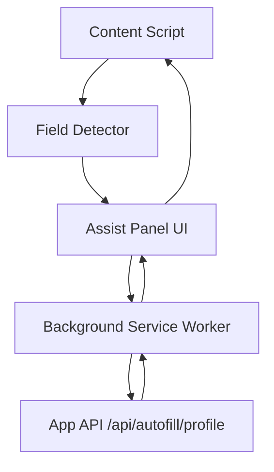

# Nextzen Orbit - Career Workspace Architecture (vNext)

Last updated: 2026-05-23

## Scope and constraints

- Build an AI-powered career workspace for the Indian job market.
- Assisted autofill only. No autonomous auto-apply or full browser automation.
- Next.js App Router, TypeScript, Tailwind CSS v4, Supabase, Groq API.
- Modular services, RLS-safe data access, reusable UI components.

## Proposed folder structure

```
nextzenorbit/
  extensions/
    nextzen-orbit-autofill/
      manifest.json
      src/
        background/
          index.ts
          auth.ts
        content/
          index.ts
          detectors/
            base.ts
            workday.ts
            greenhouse.ts
            lever.ts
            linkedin.ts
          mappers/
            profile-mapper.ts
            resume-mapper.ts
          ui/
            assist-panel.tsx
        shared/
          messages.ts
          storage.ts
      ui/
        popup/
          index.html
          popup.tsx
        options/
          index.html
          options.tsx
      build/
  src/
    app/
      career/
        [slug]/
          page.tsx
      api/
        careers/
        jobs/
        youtube/
        roadmaps/
        interview-questions/
        ai-notes/
        projects/
        applications/
        autofill/
          session/
          profile/
    actions/
      profile-actions.ts
      ai-notes-actions.ts
      applications-actions.ts
      projects-actions.ts
    components/
      career/
      jobs/
      interview/
      notes/
      projects/
      resources/
      ui/
    hooks/
      use-career.ts
      use-jobs.ts
      use-notes.ts
    lib/
      api/
        errors.ts
        response.ts
        validate.ts
      supabase/
        client.ts
        server.ts
        admin.ts
        queries/
          careers.ts
          jobs.ts
          youtube.ts
          roadmaps.ts
          interview-questions.ts
          ai-notes.ts
          projects.ts
          applications.ts
      ai/
        groq.ts
        prompts/
          ai-notes.ts
      jobs/
        adzuna.ts
      youtube/
        youtube-client.ts
      utils/
    services/
      careers-service.ts
      jobs-service.ts
      youtube-service.ts
      roadmaps-service.ts
      interview-service.ts
      notes-service.ts
      projects-service.ts
      applications-service.ts
      autofill-service.ts
    types/
      domain/
        careers.ts
        jobs.ts
        roadmaps.ts
        interview.ts
        notes.ts
        projects.ts
        applications.ts
      api/
        responses.ts
  supabase/
    migrations/
      014_career_workspace.sql
```

## Data model and relationships

- Careers are the top-level role entities for the career pages.
- Roadmaps belong to a career and contain ordered steps.
- Interview questions and YouTube resources attach to a career or role.
- AI notes are user-owned and cached by topic.
- Projects are user-owned with GitHub links and screenshots.
- Jobs are aggregated from external sources and cached for search.
- Applications remain user-owned and can reference jobs by URL.

## Database schema SQL

- New tables and RLS policies are defined in supabase/migrations/014_career_workspace.sql.

## Service layer responsibilities

- CareerService: career listing and career page aggregation.
- JobsService: search, filtering, ingestion, and job card data shaping.
- YouTubeService: API search + caching rules.
- RoadmapService: roadmap retrieval and step ordering.
- InterviewService: filtering by role, company, difficulty, topic.
- NotesService: generate notes with Groq and cache results per topic.
- ProjectsService: CRUD for user projects and screenshots.
- ApplicationsService: CRUD and status transitions.
- AutofillService: profile fetch + mapping schema for the extension.

## Supabase query layer

- Use server client for user-scoped queries and admin client for ingestion.
- Keep query functions in lib/supabase/queries with small, composable methods.
- Enforce RLS at the table level for user-owned data.

## API utility functions

- response.ts: ok(), fail(), and consistent error shape.
- validate.ts: zod parsing for body and query params.
- errors.ts: ApiError, mapDbError, and status normalization.

## TypeScript interfaces (example)

```ts
export interface Career {
  id: string;
  title: string;
  slug: string;
  description: string | null;
  icon: string | null;
}

export interface Job {
  id: string;
  company: string;
  title: string;
  description: string | null;
  location: string | null;
  applyUrl: string | null;
  source: string;
  tags: string[];
  createdAt: string;
}
```

## Extension architecture

- Content scripts detect fields and build a normalized field map.
- The assist panel presents suggestions and fills on user action.
- Background script manages auth and message routing.
- No auto-submit. The user always clicks submit.

```
page DOM -> content script -> field detector -> mapping -> assist panel
                                 |                           |
                                 +-> background -> app API <-+
```

### Message flow



## Environment variables

```
# App
NEXT_PUBLIC_APP_URL=

# Supabase
NEXT_PUBLIC_SUPABASE_URL=
NEXT_PUBLIC_SUPABASE_ANON_KEY=
SUPABASE_SERVICE_ROLE_KEY=

# AI
GROQ_API_KEY=

# Jobs
ADZUNA_APP_ID=
ADZUNA_APP_KEY=

# YouTube
YOUTUBE_API_KEY=

# Extension auth
EXTENSION_TOKEN_SECRET=
NEXT_PUBLIC_EXTENSION_ID=
```

## Implementation roadmap

Phase 1
- Profile system hardening and autofill-ready data mapping.
- Assisted autofill extension (Workday, Greenhouse, Lever, LinkedIn Easy Apply).
- Job aggregation ingest + job card UI + search/filter.
- Application tracking polish (kanban + table parity).

Phase 2
- Dynamic career pages with roadmap, interview questions, and resources.
- YouTube resource ingestion and caching.
- Roadmap progress UI with sectioned steps.

Phase 3
- AI notes generation with Groq and DB caching.
- Personalized recommendations for roles, jobs, and resources.
- Preference-based ranking and saved items.

## Migration notes

- Existing auto-apply worker and queue are superseded by assisted autofill.
- Keep job_queue data read-only or deprecate once extension is live.
