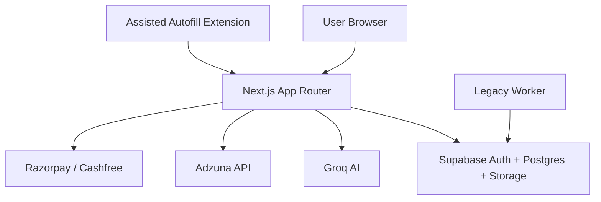
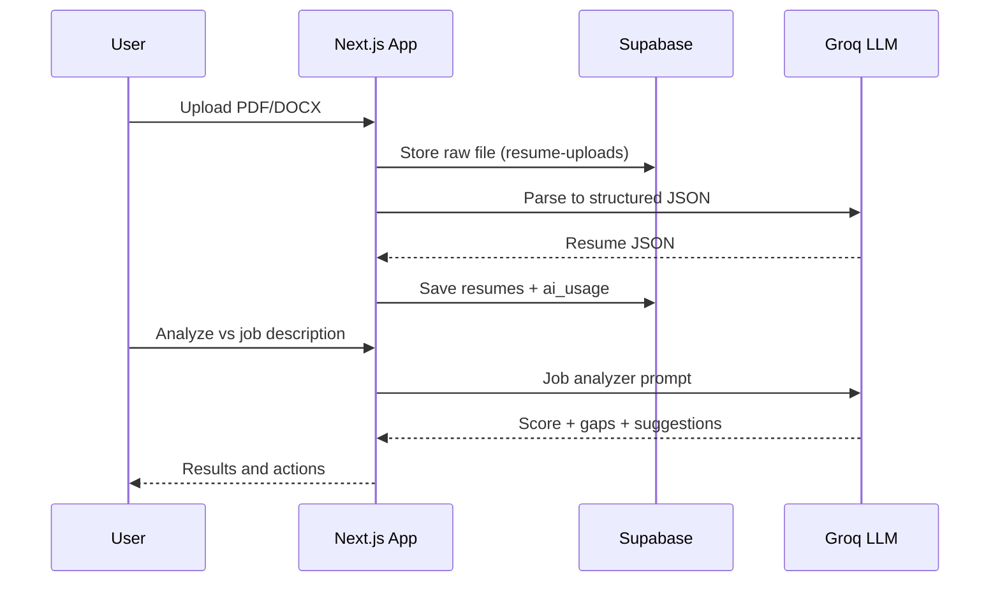

# Project Report - Nextzen Orbit

Date: 2026-05-24

## 1. Executive Summary
Nextzen Orbit is an AI-assisted job search workspace for the Indian market. The app combines resume creation, AI analysis and tailoring, cover letter generation, application tracking, and job search with an assisted autofill concept. The core app is production-grade in resumes and analysis, while subscription enforcement and autofill reliability are still in-progress.

## 2. Business Context and Goals
Primary audiences:
- Job seekers in India who need faster, higher-quality applications.
- Candidates who want resume and cover letter optimization with AI.
- Internal stakeholders who plan to monetize through subscriptions.

Core outcomes:
- Better resume quality and faster iteration cycles.
- Clear visibility of job applications and status pipelines.
- A path to paid tiers once enforcement and checkout are finished.

## 3. Tech Stack and Dependencies
Frontend and framework:
- Next.js 16 App Router, React 19, TypeScript.
- Tailwind CSS v4 with custom design tokens and animations.
- next-themes for theming, sonner for toasts.
- Lucide React icons.
- Google Fonts loaded via next/font: Sora and Space Grotesk.

Backend and services:
- Supabase (Postgres + Auth + Storage).
- Google OAuth via Supabase Auth.
- Groq API (LLaMA 3.3 70B) for resume analysis and parsing.
- Adzuna API for job search.
- Razorpay (primary) and Cashfree (secondary) for payments.

Other libraries:
- react-hook-form + Zod for forms and validation.
- @react-pdf/renderer and docx for export.
- mammoth and unpdf for resume parsing.
- Framer Motion for UI animation.

## 4. Project Structure Overview
Top-level folders:
- src/app: App Router routes and API endpoints.
- src/components: UI primitives, layout, and feature components.
- src/lib: Supabase clients, AI prompts, payments, and validation.
- src/hooks: Client hooks for user and subscription state.
- src/services: Career workspace data services.
- src/types: API and database types.
- public: Static assets and logos.
- supabase/migrations: Database schema and policies.
- scripts: Seed and utility scripts.
- worker: Legacy Playwright auto-apply worker (deprecated).
- docs: Product, architecture, and operational documentation.

## 5. Global Layout, SEO, and Performance
Layout and providers:
- Root layout defines metadata (title template, description, keywords) and loads fonts via next/font.
- Providers: next-themes theme provider (default dark, system disabled) and Sonner toasts.

Styling system:
- globals.css defines light and dark tokens, CSS variables, and animation keyframes.
- Tailwind v4 theme tokens map to the design system variables.

Images and optimization:
- next.config.ts allows Google avatar image domains for Supabase/Google OAuth.

Security headers:
- No custom security headers are configured in next.config.ts; platform defaults apply.

## 6. Architecture and Data Flow Diagrams

System architecture:

Data flow (resume upload + analysis):

## 7. Route Inventory and Behavior

### Public and Auth Routes
- / (Home)
  - Landing page with feature highlights, pricing, and CTAs.
  - Authenticated users redirect to /dashboard.

- /login, /register, /verify
  - Supabase Google OAuth entry points and verification placeholder.

### Dashboard Routes
- /dashboard
  - Overview, metrics, and placeholder widgets.

- /profile
  - Profile and job preference management.

- /resumes
  - Resume list, create, upload, delete.

- /resumes/[id]
  - Resume editor with live preview and AI actions.

- /analyzer
  - Resume vs job description analyzer.

- /cover-letter
  - Cover letter generation and export.

- /applications
  - Application tracker with kanban and table views.

- /job-search
  - Adzuna job search and legacy queue actions.

- /subscription
  - Plan and usage view; upgrade UX not finalized.

- /settings
  - Account settings and security placeholders.

### API Routes (Grouped)
- Auth: /api/auth/callback
- Profiles: /api/profile
- Resumes: /api/resumes, /api/resumes/upload, /api/resumes/[id], /api/resumes/[id]/export
- Resume AI: /api/resumes/[id]/enhance, /improve, /optimize, /tailor
- Resume versions: /api/resumes/[id]/versions, /versions/[versionId]/restore
- Analyzer: /api/analyzer
- Cover letters: /api/cover-letter/generate, /api/cover-letter/export
- Applications: /api/applications, /api/applications/[id]
- Jobs: /api/jobs/search, /api/jobs/queue, /api/jobs/screenshot
- Payments: /api/payments/create-order
- Webhooks: /api/webhooks/razorpay, /api/webhooks/cashfree
- Cron: /api/cron/cleanup

## 8. Component Inventory

Core layout and providers:
- Providers wrapper with theme and toasts.
- Sidebar, top nav, and page header layout components.

Resume system:
- Resume editor with preview, section editors, and action bar.
- Resume list/grid with upload and delete flows.
- Template selector and version history controls.

Analyzer and cover letters:
- Job analyzer form, keyword heatmap, and radar chart.
- Cover letter generator and export UI.

Applications:
- Kanban board with drag/drop and modal CRUD.
- Table view with search and filters.

Subscription:
- Plan cards and subscription details panel.

UI primitives:
- Button, card, input, textarea, modal, sheet, badge, skeleton, avatar.

## 9. Data Model (Supabase)

Primary tables:
- users: app-level identity mirror for auth users.
- profiles: user profile, job preferences, and subscription tier.
- subscriptions: plan, billing, and trial state.
- resumes: structured resume JSON and metadata.
- resume_versions: snapshot history for rollback.
- cover_letters: table exists; generation flow does not persist yet.
- applications: kanban and table tracking.
- job_queue: legacy auto-apply queue (deprecated).
- ai_usage: token usage per billing period.
- webhook_events: payment webhook audit log.

Career workspace (vNext):
- careers, jobs, youtube_resources, roadmaps, roadmap_steps, interview_questions, ai_notes, projects.

Storage buckets:
- resumes (private) and resume-uploads (raw uploads).
- screenshots (legacy worker proof images).

## 10. Supabase Integration Details
- Server client: src/lib/supabase/server.ts (cookie-aware SSR).
- Client client: src/lib/supabase/client.ts (browser usage).
- Admin client: src/lib/supabase/admin.ts (service-role, bypasses RLS).
- RLS enabled on all tables; service-role used for privileged flows.
- Auth: Supabase Google OAuth callback at /api/auth/callback.

## 11. Resume and AI Pipeline
- Upload PDF/DOCX, store raw file, parse text using mammoth/unpdf.
- Groq prompts normalize resume to structured JSON.
- Resume editor supports autosave, versioning, and export.
- AI actions: analyzer, enhance, improve, optimize, and tailor.
- AI usage tracked in ai_usage.

## 12. Job Search, Applications, and Assisted Autofill
- Adzuna search populates job listings in /job-search.
- Applications tracked in kanban/table views.
- Legacy job_queue remains for historical data.
- Assisted autofill extension is the target direction; legacy Playwright worker is deprecated.

## 13. Deployment and Hosting
- Documented deployment: Fly.io (see docs/DEPLOYMENT.md).
- Hosting target to confirm: Vercel is possible for Next.js; update once confirmed.
- Build commands: npm run build, npm run start.
- Ensure environment variables are set for the chosen host.

## 14. Environment Variables (Placeholders)

Public (exposed to client):
- NEXT_PUBLIC_SUPABASE_URL=
- NEXT_PUBLIC_SUPABASE_ANON_KEY=
- NEXT_PUBLIC_APP_URL=
- NEXT_PUBLIC_EXTENSION_ID= (if extension used)

Server-only:
- SUPABASE_SERVICE_ROLE_KEY=
- GROQ_API_KEY=
- ADZUNA_APP_ID=
- ADZUNA_APP_KEY=
- RAZORPAY_KEY_ID=
- RAZORPAY_KEY_SECRET=
- RAZORPAY_WEBHOOK_SECRET=
- CASHFREE_APP_ID=
- CASHFREE_SECRET_KEY=
- CRON_SECRET=
- YOUTUBE_API_KEY=
- EXTENSION_TOKEN_SECRET=

## 15. Accounts and Passwords (Fill In)

Vercel (if used):
- Account email:
- Team name:
- Project name:
- Region:
- 2FA enabled (yes/no):

Fly.io (if used):
- Account email:
- App name:
- Region:
- 2FA enabled (yes/no):

Supabase:
- Organization:
- Project name:
- Project ref:
- Admin email:
- Billing owner:

Google Cloud / OAuth:
- Project ID:
- OAuth client ID:
- OAuth client secret:
- Consent screen support email:

Groq:
- Account email:
- API key:

Adzuna:
- Account email:
- App ID:
- App key:

Razorpay:
- Account email:
- Key ID:
- Key secret:
- Webhook secret:

Cashfree:
- Account email:
- App ID:
- Secret key:

Chrome Web Store (extension, if used):
- Publisher email:
- Extension ID:

Domain / DNS:
- Registrar:
- DNS provider:
- Primary domain:
- SSL / certificates:

## 16. Scripts and Maintenance Tasks

Scripts:
- scripts/fix-rls.ts
  - Prints SQL guidance for RLS recursion fixes.
- scripts/remove-hero-bg.py
  - Utility script for asset cleanup.
- scripts/seed (TypeScript seed runner)
  - Seeds careers, roadmaps, interview questions, and YouTube resources.
- npm run seed:career-workspace
  - Runs the seed script for the career workspace dataset.

Supabase migrations (chronological):
- 001_initial_schema.sql
- 002_resume_storage.sql
- 003_add_avatar_url.sql
- 004_full_name.sql
- 005_fix_users_rls_recursion.sql
- 006_add_deleted_at.sql
- 007_fix_all_rls_recursion.sql
- 008_resume_versions_cover_letters.sql
- 009_applications_table.sql
- 010_storage_buckets.sql
- 011_job_preferences.sql
- 012_job_queue.sql
- 013_screenshot_columns.sql
- 014_career_workspace.sql

## 17. Risks and Recommendations
- Subscription enforcement and plan limits are disabled or inconsistent with UI.
- Cover letter generation does not persist to the cover_letters table.
- /api/cover-letter/export does not enforce auth in the route itself.
- Resume delete behavior and comments are inconsistent (soft vs hard delete).
- Docs and README are partly out of date versus code.

## 18. Public Assets
Key public files:
- SVG assets: globe.svg, file.svg, next.svg, vercel.svg, window.svg.
- Branding assets referenced by the landing page (e.g., Nextzen Orbit logos).

## 19. Legacy Folder
The worker/ directory is the deprecated Playwright auto-apply system. It is kept for historical context but is not part of the assisted autofill roadmap.
